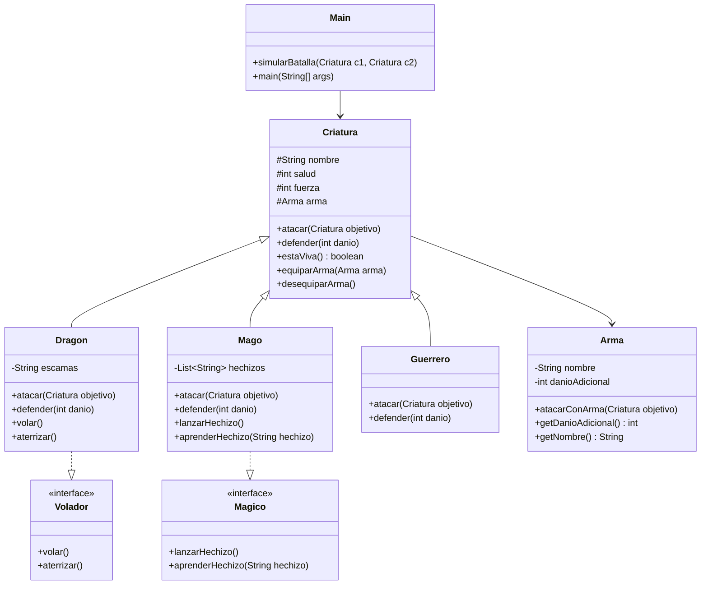

# Diagrama de Clases



# Proyecto: Sistema de Batalla de Criaturas

## Descripción

Este proyecto corresponde al parcial práctico de Programación II. Se desarrolló un sistema de batalla entre criaturas utilizando los principios de Programación Orientada a Objetos en Java.

## Objetivo

Implementar un sistema donde diferentes criaturas puedan enfrentarse en combate, aplicando conceptos como herencia, polimorfismo, interfaces, composición y pruebas unitarias.

## Tecnologías Utilizadas

- Java 21
- Maven
- JUnit 5
- Visual Studio Code
- Git y GitHub

## Estructura del Proyecto

- Criatura: clase abstracta base
- Dragon, Mago, Guerrero: clases concretas
- Volador, Magico: interfaces
- Arma: clase para composición
- Main: simulación de batalla
- CriaturaTest: pruebas unitarias

## Funcionalidades

- Ataque entre criaturas
- Defensa y reducción de salud
- Uso de armas con daño adicional
- Habilidades especiales:
  - El dragón puede volar
  - El mago puede lanzar hechizos
- Simulación de batalla hasta que una criatura muere

## Desarrollo del Trabajo

1. Se creó la clase abstracta Criatura con atributos nombre, salud y fuerza, además de los métodos atacar, defender y estaViva.

2. Se implementaron las interfaces Volador y Magico para representar habilidades especiales.

3. Se desarrolló la clase Arma para aplicar el concepto de composición, permitiendo añadir daño adicional a las criaturas.

4. Se crearon las clases Dragon, Mago y Guerrero, que heredan de Criatura e implementan sus propios comportamientos.

5. Se implementaron habilidades específicas:
   - Dragon implementa Volador
   - Mago implementa Magico

6. Se desarrolló la clase Main para ejecutar la simulación de batallas entre criaturas.

7. Se configuró el proyecto con Maven y se integró JUnit 5 para realizar pruebas unitarias.

8. Se crearon pruebas en CriaturaTest para validar:
   - El estado de vida de una criatura
   - La reducción de salud al recibir daño
   - El daño doble del dragón
   - El uso de armas
   - El aprendizaje de hechizos

## Ejecución

Para ejecutar las pruebas unitarias:

```bash
mvn clean test
```

Para ejecutar el programa principal, correr la clase Main desde el entorno de desarrollo.

## Resultado

Se obtuvo un sistema funcional que cumple con los requisitos del parcial, implementando correctamente los conceptos de Programación Orientada a Objetos y validando su comportamiento mediante pruebas unitarias.

## Control de Versiones

Se utilizó Git y GitHub para el manejo del repositorio, realizando commits separados para el código y la documentación, siguiendo buenas prácticas de desarrollo.